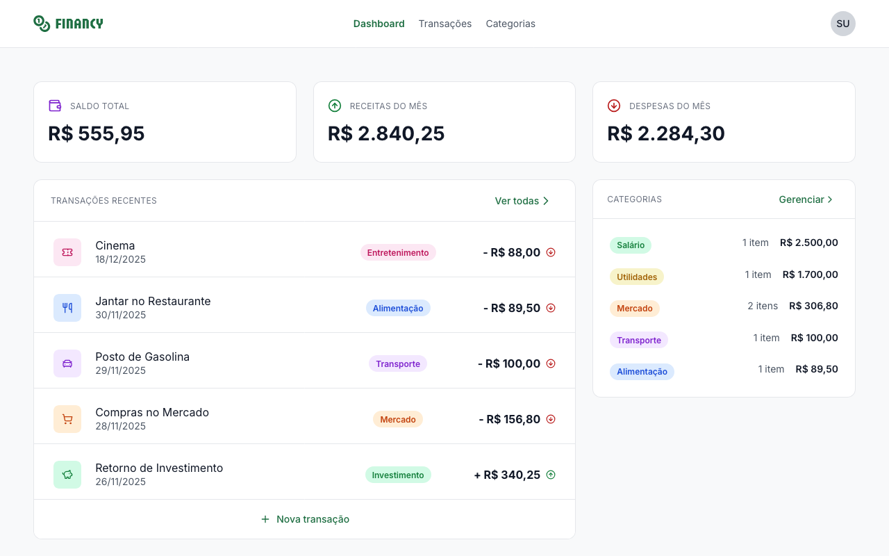

# Financy

<p align="center">
	<b>Full-stack financial management app</b><br>
	<i>Built as a final postgraduate project at Rocketseat Faculty of Technology</i>
	
</p>

---

## 🚀 Quick Start (First Run)

Follow these steps to get the project running locally for the first time:

### 1. Prerequisites

- [Node.js 20+](https://nodejs.org/)
- [pnpm](https://pnpm.io/)
- [Git](https://git-scm.com/)

### 2. Clone the repository and initialize submodules

```bash
git clone <repo-url>
cd financy
git submodule update --init --recursive
```

### 3. Install monorepo dependencies

```bash
# In the root folder
pnpm install
```

### 4. Setup backend

```bash
cd financy-server 
```

- Environment variables

```bash
cp .env.example .env.dev
# Edit .env.dev if needed (see financy-server/README.md for required variables)
```

- Install dependencies

```bash
# In backend
pnpm install
```

- Run the backend

```bash
pnpm dev:db   # generate Prisma client, create/apply migrations, and seed the database
pnpm dev            # start the backend server
```

Backend GraphQL API: http://localhost:3333/graphql

### 5. Setup front 

```bash
cd financy-server 
```

- Setup environment variables

```bash
cp .env.example .env.dev
# Edit .env.dev if needed (see financy-server/README.md for required variables)
```

- Install dependencies

```bash
# In the root folder
pnpm install
```

- Run the frontend

```bash
pnpm dev
```

Frontend app: http://localhost:5173

---

## 📁 Monorepo Structure

- `financy-server`: GraphQL API (Fastify, Apollo Server, TypeGraphQL, Prisma)
- `financy-web`: React + Vite web client (Apollo Client)

See each folder's README for more details and advanced usage.

---

## 🛠️ Main Technologies

- Backend: Node.js, TypeScript, Fastify, Apollo Server, TypeGraphQL, Prisma, SQLite, Vitest
- Frontend: React 19, TypeScript, Vite, Apollo Client, React Hook Form, Zod, Zustand, Tailwind CSS
- Quality: Biome, Vitest

---

## ✅ Challenge Requirements Status

- Account creation and sign in: implemented
- User can manage only their own transactions: implemented
- User can manage only their own categories: implemented
- Create transaction: implemented
- Delete transaction: implemented
- Edit transaction: implemented
- List transactions: implemented
- Create category: implemented
- Delete category: implemented
- Edit category: implemented
- List categories: implemented

---

## ℹ️ More Info

- Backend setup, environment variables, and scripts: [financy-server/README.md](./financy-server/README.md)
- Frontend setup, scripts, and structure: [financy-web/README.md](./financy-web/README.md)

## Prerequisites

- Node.js 20+
- pnpm
- Git with submodules initialized

## Run the Full Project

### 1. Backend

```bash
cd financy-server
pnpm install
cp .env.example .env.dev
# Add COOKIE_SECRET if it is missing in .env.dev
pnpm dev:generate
pnpm dev:migrate
pnpm dev
```

GraphQL API: `http://localhost:3333/graphql`

### 2. Frontend

```bash
cd financy-web
pnpm install
pnpm dev
```

Web app: `http://localhost:5173`

## Tests and Quality

- Backend tests: `pnpm test`, `pnpm test:watch`, `pnpm test:coverage`
- Frontend quality checks: `pnpm lint`, `pnpm check:biome`, `pnpm build`

## Notes

- Backend GraphQL schema is generated from registered resolvers.
- Frontend authentication flow and route protection are available.
- Dashboard, transactions, and categories UX in the frontend are under active iteration.
